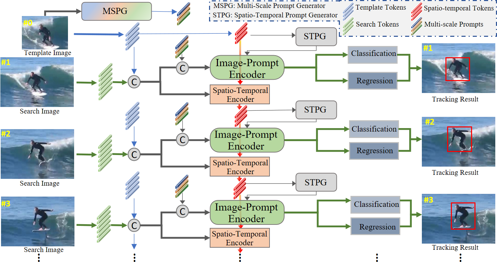

# [AAAI'2024] - EVPTrack

The official implementation for the **AAAI 2024** paper \[[_Explicit Visual Prompts for Visual Object Tracking_](https://arxiv.org/abs/2401.03142)\].

[[Models](https://drive.google.com/drive/folders/1KqpBOGAoUrN8XCU0TkPtuF-ouAyla9kP?usp=drive_link)], [[Raw Results](https://drive.google.com/file/d/1VCWn872lerG00-I1r07BI89JFfcHarwD/view?usp=sharing)], [[Training logs](https://drive.google.com/drive/folders/1xyWi3BThfZ6WUyzRGWut_cSVdHtb4oOq?usp=drive_link)]

<!-- [](https://paperswithcode.com/sota/visual-object-tracking-on-tnl2k?p=seqtrack-sequence-to-sequence-learning-for)
[](https://paperswithcode.com/sota/visual-object-tracking-on-lasot?p=seqtrack-sequence-to-sequence-learning-for)
[](https://paperswithcode.com/sota/visual-object-tracking-on-lasot-ext?p=seqtrack-sequence-to-sequence-learning-for)
[](https://paperswithcode.com/sota/visual-object-tracking-on-trackingnet?p=seqtrack-sequence-to-sequence-learning-for)
[](https://paperswithcode.com/sota/visual-object-tracking-on-got-10k?p=seqtrack-sequence-to-sequence-learning-for)
[](https://paperswithcode.com/sota/visual-object-tracking-on-uav123?p=seqtrack-sequence-to-sequence-learning-for)
[](https://paperswithcode.com/sota/visual-object-tracking-on-needforspeed?p=seqtrack-sequence-to-sequence-learning-for) -->


## Highlights

### :star2: New Explicit Visual Prompts-base Tracking Framework

<p align="center">
  
</p>

EVPTrack is a simple and high performance tracker. It achieves SOTA performance on multiple benchmarks by utilizing spatio-temporal and multi-scale template information. 


### :star2: Strong Performance

| Tracker      | GOT-10K (AO) | LaSOT (AUC) | TrackingNet (AUC) | LaSOT_ext (AUC) | UAV123 (AUC) | TNL2K (AUC) |
|:------------:|:------------:|:-----------:|:-----------------:|:---------------:|:------------:|:-----------:|
| EVPTrack-384 | 76.6         | 72.7        | 84.4              | 53.7            | 70.9         | 59.1        |
| EVPTrack-224 | 73.3         | 70.4        | 83.5              | 48.7            | 70.2         | 57.5        | 
 


## Install the environment
```
conda create -n evptrack python=3.8
conda activate evptrack
bash install.sh
```


## Data Preparation
Put the tracking datasets in ./data. It should look like:
   ```
   ${PROJECT_ROOT}
    -- data
        -- lasot
            |-- airplane
            |-- basketball
            |-- bear
            ...
        -- got10k
            |-- test
            |-- train
            |-- val
        -- coco
            |-- annotations
            |-- images
        -- trackingnet
            |-- TRAIN_0
            |-- TRAIN_1
            ...
            |-- TRAIN_11
            |-- TEST
   ```


## Set project paths
Run the following command to set paths for this project
```
python tracking/create_default_local_file.py --workspace_dir . --data_dir ./data --save_dir ./output
```
After running this command, you can also modify paths by editing these two files
```
lib/train/admin/local.py  # paths about training
lib/test/evaluation/local.py  # paths about testing
```


## Training
Download pre-trained [MAE HiViT-Base weights](https://drive.google.com/file/d/1VZQz4buhlepZ5akTcEvrA3a_nxsQZ8eQ/view?usp=share_link) and put it under `$PROJECT_ROOT$/pretrained_networks` (different pretrained models can also be used, see [MAE](https://github.com/facebookresearch/mae) for more details).

```
python tracking/train.py \
--script evptrack --config EVPTrack-full-224 \
--save_dir ./output \
--mode multiple --nproc_per_node 4 \
--use_wandb 0
```

Replace `--config` with the desired model config under `experiments/evptrack`.

We use [wandb](https://github.com/wandb/client) to record detailed training logs, in case you don't want to use wandb, set `--use_wandb 0`.


## Test and Evaluation

- LaSOT or other off-line evaluated benchmarks (modify `--dataset` correspondingly)
```
python tracking/test.py --tracker_param EVPTrack-full-224 --dataset lasot --threads 8 --num_gpus 4
python tracking/analysis_results.py # need to modify tracker configs and names
```
- GOT10K-test
```
python tracking/test.py  --tracker_param EVPTrack-full-224 --dataset got10k --threads 8 --num_gpus 4
```
- TrackingNet
```
python tracking/test.py  --tracker_param EVPTrack-full-224 --dataset trackingnet --threads 8 --num_gpus 4
```


## Test FLOPs, and Speed
*Note:* The speeds reported in our paper were tested on a single RTX2080Ti GPU.

```
python tracking/profile_model.py --script evptrack --config baseline
```


## Acknowledgments
* Thanks for the [OSTrack](https://github.com/botaoye/OSTrack) and [PyTracking](https://github.com/visionml/pytracking) library, which helps us to quickly implement our ideas.


## Citation
If our work is useful for your research, please consider citing:

```Bibtex
@inproceedings{shi2024evptrack,
  title={Explicit Visual Prompts for Visual Object Tracking}, 
  author={Liangtao Shi and Bineng Zhong and Qihua Liang and Ning Li and Shengping Zhang and Xianxian Li},
  booktitle={AAAI},
  year={2024}
}
```